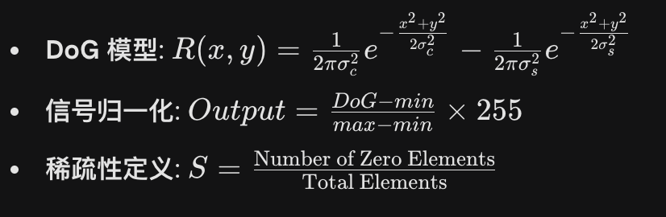

# 🎓 PyRetina 项目答辩与理论备忘录 (Project Defense & Theory Guide)

> **文档说明**：本文档旨在辅助项目汇报与答辩。包含项目核心逻辑、算法原理深度解析、关键问题回应策略及演示流程指南。

---

## 1. 项目核心定义 (The Elevator Pitch)

如果老师问：“一句话介绍你的项目是什么？”

> **“本项目实现了一个基于标准帧相机的神经形态视觉仿真系统。它通过模拟生物视网膜的‘中心-周边拮抗’机制，将传统的 RGB 图像流实时转换为类事件相机（Event-like）的稀疏时空数据，并构建了相应的可视化分析平台。”**

### 1.1 逻辑闭环

* **输入 (Input)**：普通摄像头采集的密集 RGB 数据（冗余高）。
* **处理 (Process)**：基于 **DoG (Difference of Gaussians)** 算子的仿生算法。
* **输出 (Output)**：稀疏的、仅包含时空变化特征的神经形态信号。
* **呈现 (Vis)**：红/蓝/绿热力图 + 实时稀疏性直方图。

---

## 2. 核心理论与算法 (Theoretical Framework)

### 2.1 为什么叫“时空数据” (Spatiotemporal Data)？

这是老师最容易质疑的点，必须清晰界定。

* **空间域 (Spatial Domain)**：
* 通过模拟感受野（Receptive Fields），提取图像平面  内的结构化特征（边缘、纹理）。
* **算法实现**：DoG 算子在空间上进行滤波。

* **时间域 (Temporal Domain)**：
* 系统对连续视频流  进行处理。生物视觉对“变化”敏感，静态背景被算法抑制，只有发生**时空变化**（运动或光照突变）的区域才会被激活。
* **算法实现**：实时帧流处理与动态更新。

### 2.2 核心机制：侧向抑制 (Lateral Inhibition)

这是实现“边缘增强”的生物学手段。

* **原理**：神经元兴奋时，会抑制其周围神经元的活动，从而突出强弱对比。
* **数学模型**：

* ：兴奋中心（收集信号，+）。
* ：抑制周边（抵消信号，-）。
* **减号 (-)**：就是侧向抑制的数学体现。

* **视觉证据**：在热力图中，亮边缘（黄色）旁边通常伴随着一道深色阴影（蓝色），这就是抑制作用产生的负信号。

### 2.3 核心效果：稀疏编码 (Sparse Coding)

这是侧向抑制产生的结果，也是生物视觉高效的原因。

* **原理**：大脑使用极少量的激活神经元来编码复杂信息。绝大多数神经元处于静默状态。
* **数据体现**：
* **平坦区域**（墙壁、纯色）：  **绿色（静默）**。
* **边缘区域**（轮廓）：  **红/蓝（激活）**。

* **视觉证据**：右下角的直方图呈现**极尖锐的峰**（集中在0附近），证明数据被极度压缩。

---

## 3. 仿真与硬件的关系 (Simulation vs Reality)

如果老师问：“这和真实的事件相机（DVS）有什么区别？”

| 特性 | 真实事件相机 (DVS 硬件) | PyRetina (本项目仿真) |
| --- | --- | --- |
| **数据源** | 物理光电二极管直接输出脉冲 | 普通 CMOS 相机采集帧图像 |
| **生成机制** | 硬件电路级的对数光强差分 | 软件算法级的 DoG 空间差分 |
| **输出形式** | 异步微秒级脉冲流 (AER) | 逐帧生成的类事件特征图 |
| **关系** | **原型** | **数学模型的验证与可视化** |

**回答话术**：

> “老师，这是一个**基于普通相机的 DVS 机制仿真**。我用算法重现了 DVS 核心的‘去冗余’和‘高动态响应’逻辑。右边的热力图是对**‘模拟神经电位’**的可视化翻译。”

---

## 4. 演示操作指南 (Demo Script)

演示时不要干坐着，要配合动作讲解，让老师看到**实时性**。

### 阶段一：引导页介绍 (The Hook)

1. **展示封面**：强调“神经形态”和“时空数据”两个关键词。
2. **展示背景 (PPT图1)**：指出传统 RGB 相机的问题——**“数据冗余”**（拍墙壁也传数据）。
3. **展示原理 (PPT图2)**：指出生物视网膜的优势——**“只传变化”**。
4. **展示核心定义**：念出屏幕上的结论：“PyRetina 是一个时空域联合滤波器”。

### 阶段二：核心仿真操作 (The Meat)

点击启动，进入主界面。

1. **静态展示（指屏幕）**：
* “左边是人眼看到的，充满冗余背景。”
* “右边是算法处理后的，背景变成了**绿色（零值）**，只有轮廓是**红黄色**。这证明系统成功过滤了冗余。”

2. **动态展示（挥手）**：
* **动作**：在摄像头前快速挥手。
* **解说**：“大家看，只有当物体运动（时空发生变化）时，右边的信号才会剧烈激活。静止不动时，信号会迅速衰减为绿色。”

3. **参数调节（动滑块）**：
* **动作**：把 `Inhibitory Sigma` (第二个滑块) 向右拉大。
* **解说**：“当我增强‘周边抑制’的范围，大家可以看到轮廓变得更加粗壮、明显。这模拟了神经元在不同模式下的适应性。”

4. **数据分析（看图表）**：
* **动作**：指向右下角直方图。
* **解说**：“这个尖峰直观地展示了**稀疏性**。90% 的数据都在 0 附近，说明我们极大地节省了理论传输带宽。”

---

## 5. 常见刁钻问题 Q&A (Defense Strategy)

**Q: 你这个和 Canny 边缘检测有什么区别？**

> **A:** “Canny 是纯粹的图像处理算法，为了找边缘而找边缘。而 DoG (本系统) 是**生物视网膜的生理学模型**。虽然结果看起来都像边缘，但 DoG 模拟的是神经元感受野的**连续响应**（有正有负，有强有弱），包含了光强变化的**幅度信息**，而 Canny 只有二值化（有/无）的结果。此外，DoG 是后续 SNN（脉冲神经网络）的标准输入层，具有更高的生物可解释性。”

**Q: 为什么你的背景不是纯黑，而是绿色的？**

> **A:** “因为我使用了 Jet Colormap 热力图来可视化数值。在我的模型中，**0（无信号）对应绿色**，**正值对应红黄**，**负值对应蓝色**。这样做是为了直观地展示**‘侧向抑制’**产生的负信号（蓝色阴影），如果用纯黑背景，就看不出抑制作用了。”

**Q: 这个系统的应用场景是什么？**

> **A:** “它可以作为**神经形态计算的前端预处理模块**。在自动驾驶或无人机场景中，通过这种算法预先过滤掉 80% 的背景冗余，可以极大地降低后端 AI 模型的计算压力，实现低功耗、低延迟的边缘计算。”

---

## 6. 附录：核心公式速查

